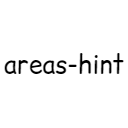

<a id="top"></a>

<p align="center">
  
</p>

<h1 align="center">Areas Hint 域名模组</h1>

<p align="center">
  
  
  
  
  
  
</p>

<p align="center">
  为你的 Minecraft 世界增添沉浸式区域名称提示。
</p>

<p align="center">
  当玩家进入你定义的区域时，屏幕上方会优雅显示该区域的名称，让建筑、地图、RPG 场景与多层级世界观拥有更强的代入感与仪式感。
</p>

<p align="center">
  <strong>Minecraft 1.20.4</strong> · <strong>Fabric Loader 0.16.14</strong> · <strong>Fabric API 0.97.2+1.20.4</strong> · <strong>Java 17</strong> · <strong>Mod 4.4.5</strong>
</p>

<p align="center">
  <a href="#quickstart">快速开始</a> ·
  <a href="#commands">命令系统</a> ·
  <a href="#data-format">数据格式</a> ·
  <a href="#development">构建与开发</a> ·
  <a href="#docs">相关文档</a>
</p>

---

## 亮点速览

| 类型 | 内容 |
|---|---|
| 区域定义 | 支持多边形区域、二级顶点 AABB 预筛选、多层级域名体系 |
| 显示能力 | 支持区域名、联合域名、维度域名、副字幕与描述查询 |
| 编辑方式 | 支持 `/areahint easyadd`、扩展/收缩/分割、签名、描述等交互式流程 |
| 性能与架构 | 采用客户端检测 + 服务端同步，并结合高度过滤与射线法优化 |

---

<a id="overview"></a>

## 概述

Areas Hint 是一个适用于 **Minecraft Fabric 1.20.4** 的区域提示模组。
它允许玩家使用多边形定义区域（项目内通常称为“域名”），并在进入区域时显示自定义名称。

模组支持：

- 多边形区域定义
- 多层级域名体系
- 高度过滤
- 维度域名显示
- 交互式区域创建与编辑
- 多种提示文字渲染与域名标题样式设置
- 域名副字幕、描述、签名与安全传送
- 多世界 / 多服务器独立数据管理
- 权限系统与地图系统兼容扩展

在设计上，模组采用**客户端检测 + 服务端同步**的思路：
客户端负责主要的区域检测与显示，服务端负责数据存储、权限处理与同步，从而在保证体验的同时尽量降低服务器负担。

---

## 特点

- **玩家自定义**：自由命名区域，设定范围、颜色、层级与高度。
- **性能友好**：结合高度预筛选、AABB 预检查与射线法检测，减少无效计算。
- **自动区域提示**：进入区域时自动显示名称，适合 RPG、建筑展示与剧情地图。
- **多级区域支持**：区域可嵌套，例如“王国 → 主城 → 王座厅”。
- **维度名称支持**：离开所有普通区域时显示当前维度名称。
- **交互式创建**：支持 `/areahint easyadd` 等命令进行交互式编辑。
- **可编辑性强**：支持扩展、收缩、分割、重命名、重新着色、修改高度、描述与副字幕。
- **权限可控**：支持基础权限节点、签名者操作规则和 LuckPerms 兼容。
- **地图与传送**：支持 BlueMap 标记扩展，并提供域名中心 / 随机安全传送。
- **显示方式丰富**：支持 CPU / OpenGL / Vulkan（实验性）以及多种域名标题样式与大小设置。
- **兼容性扩展**：可与 LuckPerms、BlueMap 等系统协同使用。

---

## 为什么选择它？

### 对玩家友好
普通玩家也可以通过交互式流程参与区域创建与修改，而不必依赖手写 JSON。

### 对服主友好
适合服务器主城、村落、副本、野区、建筑区、剧情区域、活动区域等管理场景。

### 对地图作者友好
可通过域名层级、维度域名与联合域名构建更完整的世界观提示系统。

### 对性能友好
模组在区域检测上采用分层优化思路，先快速排除，再进行精确判断。

---

## 适合场景

- **RPG 服务器**：为主城、王国、村庄、副本、野区、地下城等区域添加名称提示。
- **冒险地图**：在关键剧情点、机关房间、隐藏区域、章节地点中展示自定义名称。
- **建筑服务器**：为大型建筑、展馆、社区区域、作者作品集提供空间标签。
- **单人生存世界**：记录家园、矿区、农场、港口、遗迹、维度据点等重要地点。

---

## 目录

- [概述](#overview)
- [特点](#特点)
- [为什么选择它？](#为什么选择它)
- [适合场景](#适合场景)
- [适用版本与依赖](#适用版本与依赖)
- [安装说明](#安装说明)
- [快速开始](#quickstart)
- [核心概念](#核心概念)
- [命令系统](#commands)
- [数据格式与配置说明](#data-format)
- [多世界 / 多服务器文件夹机制](#多世界--多服务器文件夹机制)
- [架构设计](#架构设计)
- [模块划分](#模块划分)
- [核心算法说明](#核心算法说明)
- [文件结构](#文件结构)
- [相关文档](#docs)
- [模组兼容性](#compatibility)
- [构建与开发](#development)
- [已知限制与说明](#已知限制与说明)

---

## 适用版本与依赖

### 基础环境

- **Minecraft**：`1.20.4`
- **Fabric Loader**：`0.16.14`
- **Yarn Mappings**：`1.20.4+build.3`
- **Fabric API**：`0.97.2+1.20.4`
- **Java**：`17`
- **当前模组版本**：`4.4.5`

### 可选兼容 / 集成

- **LuckPerms**：权限节点兼容
- **BlueMap**：地图标记相关扩展
- **Mod Menu**：可选配置界面集成
- **Sodium**：已在 `fabric.mod.json` 中作为建议兼容项列出

---

## 安装说明

### 客户端安装
1. 安装 **Fabric Loader**
2. 安装 **Fabric API**
3. 将本模组的 `.jar` 文件放入 `mods` 文件夹
4. 启动游戏

### 服务端安装
1. 安装 **Fabric Loader**
2. 安装 **Fabric API**
3. 将本模组的 `.jar` 文件放入服务端 `mods` 文件夹
4. 启动服务端

### 推荐安装方式
为了获得完整功能，建议**客户端与服务端同时安装**。
在单人世界中，客户端与集成服务端会共同工作。

---

<a id="quickstart"></a>

## 快速开始

第一次使用时，建议按下面流程体验：

1. 安装模组并进入世界
2. 执行 `/areahint easyadd`
3. 按交互流程依次设置：
   - 域名名称
   - 域名等级
   - 上级域名（如果有）
   - 顶点记录
   - 高度范围
   - 颜色设置
4. 完成后进入该区域，查看顶部提示效果
5. 可使用 `/areahint addsubtitle` 为域名添加副字幕，或使用 `/areahint adddescription` 添加书本式描述
6. 可使用 `/areahint check` 查看当前联合域名
7. 若手动修改了配置文件或区域文件，可使用 `/areahint reload` 重新加载

---

## 核心概念

### 1. 域名
本项目中的“域名”不是网络域名，而是**你为某个游戏区域定义的名称单位**。
例如：

- 王国
- 主城
- 商业区
- 王座厅
- 地下矿井

### 2. 一级顶点 `vertices`
域名多边形本体的顶点集合，用于真正的区域形状判断。

### 3. 二级顶点 `second-vertices`
二级顶点是对区域边界的辅助描述，常用于包围盒（AABB）预筛选等快速判断。
你也可以理解为用于加速检测的边界矩形信息。

### 4. 域名等级 `level`
- `1`：顶级域名
- `2`：二级域名
- `3`：三级域名
- 以此类推，**数字越大，层级越低**
- 普通域名等级应为整数
- 维度域名在概念上属于 `0.5` 级，低于所有普通区域，但通常单独存放在维度域名配置中

### 5. 上级域名 `base-name`
指向该域名所属的上一级域名。
例如：

- `王座厅` 的 `base-name` 可以是 `主城`
- `主城` 的 `base-name` 可以是 `王国`

### 6. 联合域名 / 表面域名 `surfacename`
用于显示组合后的名称，或用于构造更适合展示的表面名称。

### 7. 创建者 `signature`
记录该域名由谁创建。
可用于权限判断、管理与追踪。

### 8. 扩展签名 `signatures`
`signatures` 是额外授权玩家列表，用于让多个玩家共同维护同一个域名或其下级域名。

### 9. 副字幕 `subtitle` / `subtitlecolor`
副字幕会显示在域名标题下方。没有 `subtitle` 字段或内容为空时不会显示副字幕；`subtitlecolor` 支持十六进制颜色，也支持模组内的闪烁颜色值。

---

<a id="commands"></a>

## 命令系统

> 更细的操作说明可参考 [`COMMAND_USAGE.md`](./COMMAND_USAGE.md)。
> 命令的实际权限表现可能受权限系统、服务器配置与版本实现影响，下面按常见使用场景整理。

### 基础命令

| 命令 | 说明 | 常见权限 |
|---|---|---|
| `/areahint help` | 显示所有命令及用法 | 所有人 |
| `/areahint reload` | 重新加载配置与域名文件 | 管理员 |
| `/areahint on` | 启用客户端域名提示 | 所有人 |
| `/areahint off` | 关闭客户端域名提示 | 所有人 |

### 域名查看与管理

| 命令 | 说明 | 常见权限 |
|---|---|---|
| `/areahint check` | 显示所有联合域名列表 | 所有人 |
| `/areahint check <联合域名>` | 查看指定联合域名详情 | 所有人 |
| `/areahint delete` | 启动交互式域名删除 | 所有人（通常仅限可操作域名） |
| `/areahint tcp [域名]` | 传送到域名中心点附近的安全位置 | 传送权限 |
| `/areahint udp [域名]` | 随机传送到域名内的安全位置 | 传送权限 |
| `/areahint settp [命令头]` | 设置传送使用的命令头，例如 `tp` 或 `minecraft:tp` | 传送设置权限 |

### 域名创建与编辑

| 命令 | 说明 | 常见权限 |
|---|---|---|
| `/areahint add <JSON>` | 通过 JSON 添加域名（保留兼容，推荐使用 `easyadd`） | 管理员 |
| `/areahint easyadd` | 启动交互式域名添加 | 所有人 |
| `/areahint addarea` | `easyadd` 的别名 | 所有人 |
| `/areahint rename` | 启动交互式域名重命名 | 所有人 |
| `/areahint addsignature` | 为域名添加扩展签名 | 管理员或可操作签名者 |
| `/areahint deletesignature` | 删除域名扩展签名 | 管理员或可操作签名者 |

### 域名几何编辑

| 命令 | 说明 | 常见权限 |
|---|---|---|
| `/areahint expandarea` | 从列表中选择域名扩展 | 所有人 |
| `/areahint expandarea <域名>` | 直接指定域名进行扩展（推荐） | 所有人 |
| `/areahint shrinkarea` | 从列表中选择域名收缩 | 所有人 |
| `/areahint shrinkarea <域名>` | 直接指定域名进行收缩（推荐） | 所有人 |
| `/areahint dividearea` | 启动交互式域名分割 | 所有人 |

### 单个顶点编辑

| 命令 | 说明 | 常见权限 |
|---|---|---|
| `/areahint addhint` | 启动交互式顶点添加 | 所有人 |
| `/areahint deletehint` | 启动交互式顶点删除 | 所有人 |

### 样式与显示设置

| 命令 | 说明 | 常见权限 |
|---|---|---|
| `/areahint recolor` | 启动交互式域名重新着色 | 所有人 |
| `/areahint sethigh` | 启动交互式域名高度设置 | 所有人 |
| `/areahint hintrender` | 查看当前渲染模式 | 所有人 |
| `/areahint hintrender <cpu\|opengl\|vulkan>` | 设置渲染模式 | 所有人 |
| `/areahint titlestyle` | 启动交互式域名标题样式选择 | 所有人 |
| `/areahint titlesize` | 启动交互式域名标题大小选择 | 所有人 |
| `/areahint addsubtitle` | 添加或替换域名副字幕 | 管理员或可操作签名者 |
| `/areahint replacesubtitle` | `addsubtitle` 的替换语义别名 | 管理员或可操作签名者 |
| `/areahint deletesubtitle` | 删除域名副字幕 | 管理员或可操作签名者 |
| `/areahint replacesubtitlecolor` | 修改域名副字幕颜色 | 管理员或可操作签名者 |
| `/areahint replacesubtitlesize` | 修改本客户端副字幕大小 | 所有人 |
| `/areahint frequency` | 显示当前检测频率 | 所有人 |
| `/areahint frequency <1-60>` | 设置检测频率，支持小数 | 所有人 |

### 描述系统

| 命令 | 说明 | 常见权限 |
|---|---|---|
| `/areahint adddescription` | 添加普通域名描述 | 管理员或可操作签名者 |
| `/areahint replacedescription` | 替换普通域名描述 | 管理员或可操作签名者 |
| `/areahint deletedescription` | 删除普通域名描述，只删除描述文件 | 管理员或可操作签名者 |
| `/areahint adddimensionalitydescription` | 添加维度域名描述 | 管理员或维度域名签名者 |
| `/areahint replacedimensionalitydescription` | 替换维度域名描述 | 管理员或维度域名签名者 |
| `/areahint deletedimensionalitydescription` | 删除维度域名描述，只删除描述文件 | 管理员或维度域名签名者 |

### 维度域名管理

| 命令 | 说明 | 常见权限 |
|---|---|---|
| `/areahint dimensionalityname` | 启动交互式维度域名管理 | 视服务器配置而定 |
| `/areahint dimensionalitycolor` | 启动交互式维度域名颜色管理 | 视服务器配置而定 |
| `/areahint firstdimname <名称>` | 首次进入无名新维度时设置维度域名 | 所有人 |
| `/areahint firstdimname_skip` | 跳过首次维度域名设置 | 所有人 |

### 其他功能

| 命令 | 说明 | 常见权限 |
|---|---|---|
| `/areahint replacebutton` | 启动交互式按键替换 | 所有人 |
| `/areahint boundviz` | 切换边界可视化显示 | 所有人 |
| `/areahint language` | 启动交互式语言选择 | 所有人 |
| `/areahint debug` | 切换调试模式 | 管理员 |
| `/areahint debug on` | 启用调试模式 | 管理员 |
| `/areahint debug off` | 关闭调试模式 | 管理员 |
| `/areahint debug status` | 查看调试状态 | 管理员 |
| `/areahint serverlanguage <语言代码>` | 设置服务端日志语言 | 控制台 / 高权限 |

> 默认权限节点位于 `areahint.command.*` 下，例如 `areahint.command.easyadd`、`areahint.command.addsubtitle`、`areahint.command.teleport`。未安装 LuckPerms 时，模组会回退到原版权限等级与签名者规则。

---

<details>
<summary><strong>展开查看完整子命令速查</strong></summary>

## 完整子命令速查

这一节按当前命令注册结构列出常用入口。交互式流程中的点击按钮会自动补全对应子命令，通常不需要手写全部步骤。

### 基础与开关

- `/areahint help`
- `/areahint reload`
- `/areahint on`
- `/areahint off`
- `/areahint debug`
- `/areahint debug on`
- `/areahint debug off`
- `/areahint debug status`
- `/areahint serverlanguage <语言代码>`

### 查看、删除与传送

- `/areahint check`
- `/areahint check <联合域名>`
- `/areahint delete`
- `/areahint delete select <域名>`
- `/areahint delete confirm`
- `/areahint delete cancel`
- `/areahint tcp`
- `/areahint tcp <域名>`
- `/areahint udp`
- `/areahint udp <域名>`
- `/areahint settp`
- `/areahint settp <命令头>`

### 维度域名

- `/areahint dimensionalityname`
- `/areahint dimensionalityname select <维度>`
- `/areahint dimensionalityname name <新名称>`
- `/areahint dimensionalityname confirm`
- `/areahint dimensionalityname cancel`
- `/areahint dimensionalitycolor`
- `/areahint dimensionalitycolor select <维度>`
- `/areahint dimensionalitycolor color <颜色>`
- `/areahint dimensionalitycolor confirm`
- `/areahint dimensionalitycolor cancel`
- `/areahint firstdimname <名称>`
- `/areahint firstdimname_skip`

### 创建与基础编辑

- `/areahint add <JSON>`
- `/areahint easyadd`
- `/areahint addarea`
- `/areahint easyadd cancel`
- `/areahint easyadd level <1-3>`
- `/areahint easyadd base <上级域名>`
- `/areahint easyadd continue`
- `/areahint easyadd finish`
- `/areahint easyadd altitude auto`
- `/areahint easyadd altitude custom`
- `/areahint easyadd altitude unlimited`
- `/areahint easyadd color <颜色>`
- `/areahint easyadd save`
- `/areahint rename`
- `/areahint rename select <域名>`
- `/areahint rename confirm`
- `/areahint rename cancel`
- `/areahint recolor`
- `/areahint recolor select <域名>`
- `/areahint recolor color <颜色>`
- `/areahint recolor confirm`
- `/areahint recolor cancel`
- `/areahint sethigh`
- `/areahint sethigh <域名>`
- `/areahint sethigh custom <域名>`
- `/areahint sethigh unlimited <域名>`
- `/areahint sethigh cancel`

### 几何与顶点编辑

- `/areahint expandarea`
- `/areahint expandarea <域名>`
- `/areahint expandarea select <域名>`
- `/areahint expandarea continue`
- `/areahint expandarea save`
- `/areahint expandarea cancel`
- `/areahint shrinkarea`
- `/areahint shrinkarea <域名>`
- `/areahint shrinkarea select <域名>`
- `/areahint shrinkarea continue`
- `/areahint shrinkarea save`
- `/areahint shrinkarea cancel`
- `/areahint dividearea`
- `/areahint dividearea select <域名>`
- `/areahint dividearea continue`
- `/areahint dividearea save`
- `/areahint dividearea name <新域名名称>`
- `/areahint dividearea level <1-3>`
- `/areahint dividearea base <上级域名>`
- `/areahint dividearea color <颜色>`
- `/areahint dividearea cancel`
- `/areahint addhint`
- `/areahint addhint select <域名>`
- `/areahint addhint continue`
- `/areahint addhint submit`
- `/areahint addhint cancel`
- `/areahint deletehint`
- `/areahint deletehint select <域名>`
- `/areahint deletehint toggle <顶点索引>`
- `/areahint deletehint submit`
- `/areahint deletehint cancel`

### 显示与客户端配置

- `/areahint frequency`
- `/areahint frequency <1-60>`（支持小数）
- `/areahint hintrender`
- `/areahint hintrender <cpu|opengl|vulkan>`
- `/areahint titlestyle`
- `/areahint titlestyle select <style>`
- `/areahint titlestyle cancel`
- `/areahint titlesize`
- `/areahint titlesize select <size>`
- `/areahint titlesize cancel`
- `/areahint replacesubtitlesize`
- `/areahint replacesubtitlesize select <size>`
- `/areahint replacesubtitlesize cancel`
- `/areahint replacebutton`
- `/areahint replacebutton confirm`
- `/areahint replacebutton cancel`
- `/areahint language`
- `/areahint language select <语言代码>`
- `/areahint language cancel`
- `/areahint boundviz`

### 副字幕、描述与签名

- `/areahint addsubtitle`
- `/areahint addsubtitle select <域名>`
- `/areahint addsubtitle color <颜色>`
- `/areahint addsubtitle confirm`
- `/areahint addsubtitle cancel`
- `/areahint replacesubtitle`
- `/areahint replacesubtitle select <域名>`
- `/areahint replacesubtitle color <颜色>`
- `/areahint replacesubtitle confirm`
- `/areahint replacesubtitle cancel`
- `/areahint deletesubtitle`
- `/areahint deletesubtitle select <域名>`
- `/areahint deletesubtitle confirm`
- `/areahint deletesubtitle cancel`
- `/areahint replacesubtitlecolor`
- `/areahint replacesubtitlecolor select <域名>`
- `/areahint replacesubtitlecolor color <颜色>`
- `/areahint replacesubtitlecolor confirm`
- `/areahint replacesubtitlecolor cancel`
- `/areahint adddescription`
- `/areahint adddescription search [关键词]`
- `/areahint adddescription select <域名>`
- `/areahint adddescription text <描述>`
- `/areahint adddescription confirm`
- `/areahint adddescription cancel`
- `/areahint replacedescription`
- `/areahint replacedescription search [关键词]`
- `/areahint replacedescription select <域名>`
- `/areahint replacedescription text <描述>`
- `/areahint replacedescription confirm`
- `/areahint replacedescription cancel`
- `/areahint deletedescription`
- `/areahint deletedescription search [关键词]`
- `/areahint deletedescription select <域名>`
- `/areahint deletedescription confirm`
- `/areahint deletedescription confirm2`
- `/areahint deletedescription cancel`
- `/areahint adddimensionalitydescription`
- `/areahint adddimensionalitydescription search [关键词]`
- `/areahint adddimensionalitydescription select <维度域名>`
- `/areahint adddimensionalitydescription text <描述>`
- `/areahint adddimensionalitydescription confirm`
- `/areahint adddimensionalitydescription cancel`
- `/areahint replacedimensionalitydescription`
- `/areahint replacedimensionalitydescription search [关键词]`
- `/areahint replacedimensionalitydescription select <维度域名>`
- `/areahint replacedimensionalitydescription text <描述>`
- `/areahint replacedimensionalitydescription confirm`
- `/areahint replacedimensionalitydescription cancel`
- `/areahint deletedimensionalitydescription`
- `/areahint deletedimensionalitydescription search [关键词]`
- `/areahint deletedimensionalitydescription select <维度域名>`
- `/areahint deletedimensionalitydescription confirm`
- `/areahint deletedimensionalitydescription confirm2`
- `/areahint deletedimensionalitydescription cancel`
- `/areahint addsignature`
- `/areahint addsignature select <域名>`
- `/areahint addsignature name <玩家名>`
- `/areahint addsignature confirm`
- `/areahint addsignature cancel`
- `/areahint deletesignature`
- `/areahint deletesignature select <域名>`
- `/areahint deletesignature name <玩家名>`
- `/areahint deletesignature confirm`
- `/areahint deletesignature confirm2`
- `/areahint deletesignature cancel`

---

## ExpandArea 与 ShrinkArea 补充说明

### ExpandArea（域名扩展）

#### 方式一：直接指定域名（推荐）
```text
/areahint expandarea <域名>
```
- 支持 Tab 补全
- 只显示你有权限扩展的域名
- 直接进入记录顶点流程

#### 方式二：从列表选择
```text
/areahint expandarea
```
- 显示可点击的域名列表
- 点击对应按钮选择域名

### ShrinkArea（域名收缩）

#### 方式一：直接指定域名（推荐）
```text
/areahint shrinkarea <域名>
```
- 支持 Tab 补全
- 只显示你有权限收缩的域名
- 直接进入记录顶点流程

#### 方式二：从列表选择
```text
/areahint shrinkarea
```
- 显示可点击的域名列表
- 显示权限提示
- 点击对应按钮选择域名

### 常见流程子命令

#### ExpandArea 子命令
- `/areahint expandarea continue`
- `/areahint expandarea save`
- `/areahint expandarea cancel`

#### ShrinkArea 子命令
- `/areahint shrinkarea continue`
- `/areahint shrinkarea save`
- `/areahint shrinkarea cancel`

</details>

---

<a id="data-format"></a>

## 数据格式与配置说明

### 域名数据格式（JSON）

```json
{
  "name": "精灵森林",
  "vertices": [
    { "x": 0, "z": 10 },
    { "x": 10, "z": 0 },
    { "x": 0, "z": -10 },
    { "x": -10, "z": 0 }
  ],
  "second-vertices": [
    { "x": -10, "z": 10 },
    { "x": 10, "z": 10 },
    { "x": 10, "z": -10 },
    { "x": -10, "z": -10 }
  ],
  "altitude": {
    "max": 100,
    "min": 0
  },
  "level": 2,
  "base-name": "蛮荒大陆",
  "signature": "player_name",
  "signatures": ["friend_name"],
  "color": "#55FFAA",
  "surfacename": "精灵森林",
  "subtitle": "林间风声与古树低语",
  "subtitlecolor": "#AAFFCC"
}
```

### 字段说明

| 字段 | 含义 | 说明 |
|---|---|---|
| `name` | 域名名称 | 玩家进入区域时看到的名称基础 |
| `vertices` | 一级顶点 | 多边形本体顶点，决定真实区域形状 |
| `second-vertices` | 二级顶点 | 辅助边界顶点，通常用于快速预筛选 |
| `altitude.min` | 最低高度 | 玩家高度低于此值时不触发 |
| `altitude.max` | 最高高度 | 玩家高度高于此值时不触发 |
| `level` | 域名等级 | 普通域名使用整数；数值越大层级越低 |
| `base-name` | 上级域名 | 指向上一级域名；顶级域名可为 `null` |
| `signature` | 创建者 | 可为玩家名或 `null` |
| `signatures` | 扩展签名 | 额外可操作玩家列表，可为空数组或省略 |
| `color` | 域名颜色 | 推荐使用十六进制颜色值，也支持模组定义的闪烁颜色 |
| `surfacename` | 联合 / 表面域名 | 用于显示层面的联合名称，可为 `null` |
| `subtitle` | 域名副字幕 | 可选字段；为空或不存在时不显示 |
| `subtitlecolor` | 副字幕颜色 | 可选字段；支持十六进制颜色或闪烁颜色 |

### 关于 `level`
- `1` 表示顶级域名
- `2` 表示二级域名
- `3` 表示三级域名
- 依此类推
- **数字越大，层级越低**
- 维度域名在概念上属于 `0.5` 级，但通常单独存储，不直接与普通区域 JSON 混写

### 配置文件格式（`config.json`）

```json
{
  "frequency": 1,
  "hintRender": "OpenGL",
  "titleStyle": "mixed",
  "enabled": true,
  "recordKey": 88,
  "titleSize": "medium",
  "subtitleSize": "auto",
  "boundVizEnabled": false,
  "language": "zh_cn",
  "languageLocked": false,
  "teleportFormat": "tp"
}
```

### 配置项说明

| 字段 | 含义 | 说明 |
|---|---|---|
| `frequency` | 检测频率 | 数值越高，检测间隔越大；需在实时性与性能之间平衡 |
| `hintRender` | 提示文字渲染模式 | 可选 `CPU`、`OpenGL`、`Vulkan`（实验性） |
| `titleStyle` | 域名标题样式 | 可选 `full`、`simple`、`mixed` |
| `enabled` | 客户端提示开关 | `true` 时显示域名提示，`false` 时关闭 |
| `recordKey` | 绑定键键码 | 默认 `88`，对应 X 键 |
| `titleSize` | 域名标题大小 | 可选 `extra_large` 到 `extra_small`，也支持 `custom:<倍率>` |
| `subtitleSize` | 副字幕大小 | 默认 `auto`，也支持标题大小同一套预设和 `custom:<倍率>` |
| `boundVizEnabled` | 边界可视化开关 | 控制 `/areahint boundviz` 的持久状态 |
| `language` | 模组语言 | 对应语言文件名，例如 `zh_cn`、`en_us` |
| `languageLocked` | 语言锁定 | 为 `true` 时不跟随游戏语言自动切换 |
| `teleportFormat` | 传送命令头 | 默认 `tp`，可设置为 `minecraft:tp`、`teleport` 等有效命令头 |

### 域名标题样式说明

| 样式 | 说明 |
|---|---|
| `full` | 显示完整域名路径 |
| `simple` | 仅显示当前所在层级的域名 |
| `mixed` | 根据层级与场景组合显示，适合作为默认选项 |

### 渲染模式说明

| 模式 | 说明 |
|---|---|
| `CPU` | 兼容性较高的软件渲染方案 |
| `OpenGL` | 默认推荐模式 |
| `Vulkan` | 当前为实验性实现；检测到 VulkanMod 时优先允许使用，否则会回退到 OpenGL |

### 维度域名配置格式（`dimensional_names.json`）

```json
[
  {
    "dimensionId": "minecraft:overworld",
    "displayName": "蛮荒大陆",
    "color": "#FFFFFF",
    "signature": null
  },
  {
    "dimensionId": "minecraft:the_nether",
    "displayName": "恶堕之域",
    "color": "#AA0000",
    "signature": null
  },
  {
    "dimensionId": "minecraft:the_end",
    "displayName": "终末之地",
    "color": "#AA00AA",
    "signature": null
  }
]
```

### 维度域名说明

- 维度域名用于在玩家**不处于任何普通区域**时显示当前维度名称
- 在概念上，维度域名的优先级低于普通区域
- 玩家刚进入世界、或离开所有普通区域时，可显示维度域名
- `color` 控制维度域名显示颜色，`signature` 用于维度描述等权限判断

### 描述文件格式

域名描述和维度域名描述不直接写入普通域名 JSON，而是存放在当前世界文件夹的 `database/` 目录中。描述文件内容为独立 JSON：

```json
{
  "description": "这里是可以通过书本界面编辑的域名描述"
}
```

---

## 多世界 / 多服务器文件夹机制

本模组支持为不同世界、不同服务器自动创建独立文件夹。
这样做的好处是：**不同存档、不同服务器之间的域名与维度域名配置互不干扰。**

### 示例目录结构

```text
.minecraft/areas-hint/
├── config.json
├── 192.168.1.100_MyServer/
│   ├── overworld.json
│   ├── the_nether.json
│   ├── the_end.json
│   ├── dimensional_names.json
│   └── database/
│       ├── overworld/
│       ├── the_nether/
│       └── the_end/
├── localhost_SinglePlayer/
│   ├── overworld.json
│   ├── dimensional_names.json
│   └── database/
└── localhost_Server/
    ├── overworld.json
    ├── the_nether.json
    ├── the_end.json
    ├── dimensional_names.json
    └── database/
```

### 工作原理

1. **连接检测**：加入世界或服务器时，检测当前连接信息
2. **文件夹创建**：若不存在对应文件夹，则自动创建
3. **文件初始化**：在对应文件夹中生成维度 JSON、`dimensional_names.json` 与 `database/` 描述目录
4. **路径重定向**：后续域名、维度域名、描述与传送操作都使用当前世界 / 当前服务器的数据路径
5. **同步一致性**：服务端与客户端通过网络同步保证当前世界上下文一致

---

## 架构设计

模组采用**客户端 - 服务端分离架构**。

### 客户端部分
- 负责读取配置与同步后的区域数据
- 执行区域检测逻辑
- 负责提示文字渲染与动画显示
- 提供交互式 UI、语言切换、描述书本界面、边界可视化与 Mod Menu 配置

### 服务端部分
- 负责区域数据与维度数据管理
- 处理命令、权限、描述文件、签名与数据同步
- 为客户端提供当前世界上下文与区域数据

---

## 模块划分

### 1. 核心模块（Core）
- 模组初始化
- 生命周期管理
- 注册命令与事件监听

### 2. 数据模型模块（Data Model）
- 域名数据结构
- 配置数据结构
- 维度域名数据结构
- 副字幕、扩展签名与描述数据结构

### 3. 文件管理模块（File Management）
- 配置目录创建
- JSON 读取与写入
- 默认配置生成
- 当前世界 `database/` 描述目录管理

### 4. 区域检测模块（Area Detection）
- AABB 预筛选
- 高度过滤
- 射线法区域判断
- 区域层级与优先级计算

### 5. 渲染模块（Rendering）
- CPU / OpenGL / Vulkan 渲染实现
- 区域提示动画
- 标题、副字幕、样式与大小控制

### 6. 网络模块（Networking）
- 服务端向客户端同步区域与维度数据
- 处理各种交互式功能的数据包

### 7. 世界文件夹管理模块（World Folder Management）
- 不同世界 / 服务器的数据路径隔离
- 自动创建与切换世界文件夹

### 8. 维度域名模块（Dimensional Names）
- 维度名称管理
- 离开普通区域时的名称显示
- 维度相关同步与 UI

### 9. 命令模块（Commands）
- 域名创建、删除、重命名
- 几何编辑
- 描述、副字幕、传送和扩展签名
- 显示设置
- 调试功能

### 10. 权限模块（Permission）
- 权限节点定义
- 权限服务封装
- LuckPerms 兼容
- 域名创建者与扩展签名者操作判断

### 11. 地图集成模块（Map Integration）
- BlueMap 兼容桥接
- 动态标记状态与颜色支持

### 12. 描述与副字幕模块（Description / Subtitle）
- 普通域名与维度域名描述的查询、添加、替换、删除
- 原版书本界面编辑描述
- 域名副字幕文本、颜色与大小管理

### 13. 传送模块（Teleport）
- 域名中心点传送
- 域名范围内随机安全落点搜索
- 客户端传送命令头配置

---

## 核心算法说明

### 射线法（Ray Casting）
模组使用射线法判断玩家当前位置是否位于多边形内部：

- 向一侧发射一条射线
- 计算它与多边形边界的交点数
- **奇数次相交**：点在多边形内
- **偶数次相交**：点在多边形外

### 优化机制
在进行精确判断前，通常会先执行：

1. **高度预筛选**
2. **AABB 包围盒快速排除**
3. **再进入射线法精确判断**

这样可以减少不必要的计算开销。

---

## 文件结构

<details>
<summary><strong>展开 / 收起完整文件结构</strong></summary>

> 这一节保留完整项目结构，便于开发、维护与快速定位源码。

```text
areas-hint-mod/
├── .claude/                         # Claude Code 配置目录
│   └── settings.local.json          # Claude Code 本地设置文件
├── .cursor/                         # Cursor 编辑器配置目录
│   └── rules/
│       ├── introduction.mdc         # Cursor 规则说明文件
│       └── rule.mdc                 # Cursor 项目规则文件
├── .github/                         # GitHub 配置目录
│   └── workflows/
│       └── build.yml                # GitHub Actions 构建工作流
├── .gradle/                         # Gradle 缓存目录（自动生成）
├── .gradle-user/                    # Gradle 用户级缓存目录
├── .idea/                           # IntelliJ IDEA 项目配置目录
├── .settings/                       # IDE 通用设置目录
├── .vscode/                         # Visual Studio Code 配置目录
├── build/                           # 构建输出目录（自动生成）
│   ├── libs/
│   │   ├── areas-hint-4.4.5.jar     # 主模组 JAR 文件
│   │   └── areas-hint-4.4.5-sources.jar # 源代码 JAR 文件
│   └── ...                          # 其他构建产物
├── bin/                             # 编译输出目录（自动生成）
├── docs/                            # 项目文档目录
│   └── superpowers/                 # 规划与设计文档目录
│       ├── plans/
│       │   └── 2026-04-12-minecart-train-link.md # 功能规划文档
│       └── specs/
│           └── 2026-04-12-minecart-train-link-design.md # 功能设计说明文档
├── gradle/                          # Gradle 构建工具目录
│   └── wrapper/
│       ├── gradle-wrapper.jar       # Gradle 包装器 JAR 文件
│       └── gradle-wrapper.properties # Gradle 包装器配置
├── run/                             # 运行时目录（自动生成）
│   ├── config/                      # 运行时配置目录
│   ├── logs/                        # 运行时日志目录
│   ├── mods/                        # 运行时模组目录
│   ├── options.txt                  # 游戏选项文件
│   └── ...                          # 其他运行时文件
├── src/                             # 源代码目录
│   ├── main/                        # 服务端代码
│   │   ├── java/
│   │   │   └── areahint/
│   │   │       ├── Areashint.java   # 服务端主类（模组入口）
│   │   │       ├── addhint/         # AddHint 服务端支持
│   │   │       │   └── AddHintServerNetworking.java # 服务端网络处理器
│   │   │       ├── command/         # 命令处理
│   │   │       │   ├── CheckCommand.java # 联合域名查看指令处理器
│   │   │       │   ├── DebugCommand.java # 调试命令处理器
│   │   │       │   ├── DimensionalNameCommands.java # 维度域名命令处理器
│   │   │       │   ├── RecolorCommand.java # 域名重新着色指令处理器
│   │   │       │   ├── RenameAreaCommand.java # 域名重命名指令处理器
│   │   │       │   ├── ServerCommands.java # 统一命令处理器
│   │   │       │   └── SetHighCommand.java # 域名高度设置指令处理器
│   │   │       ├── data/            # 数据模型
│   │   │       │   ├── AreaData.java # 区域数据模型（含高度、颜色、签名、副字幕、联合域名字段）
│   │   │       │   ├── ConfigData.java # 配置数据模型
│   │   │       │   └── DimensionalNameData.java # 维度域名数据模型
│   │   │       ├── debug/           # 调试功能
│   │   │       │   └── DebugManager.java # 服务端调试管理器
│   │   │       ├── deletehint/      # DeleteHint 服务端支持
│   │   │       │   └── DeleteHintServerNetworking.java # 服务端网络处理器
│   │   │       ├── description/     # 描述系统服务端支持
│   │   │       │   ├── DescriptionData.java # 描述数据模型
│   │   │       │   ├── DescriptionFileManager.java # 描述文件管理
│   │   │       │   └── DescriptionServerNetworking.java # 描述网络处理
│   │   │       ├── dimensional/     # 维度域名管理
│   │   │       │   └── DimensionalNameManager.java # 服务端维度域名管理器
│   │   │       ├── dividearea/      # DivideArea 域名分割支持
│   │   │       │   └── DivideAreaServerNetworking.java # 服务端网络处理器
│   │   │       ├── easyadd/         # EasyAdd 服务端支持
│   │   │       │   └── EasyAddServerNetworking.java # 服务端网络处理器
│   │   │       ├── expandarea/      # ExpandArea 域名扩展支持
│   │   │       │   └── ExpandAreaServerNetworking.java # 服务端网络处理器
│   │   │       ├── file/            # 文件操作
│   │   │       │   ├── FileManager.java # 文件管理器（读写配置和区域数据）
│   │   │       │   └── JsonHelper.java # JSON 序列化工具
│   │   │       ├── i18n/            # 国际化支持
│   │   │       │   └── ServerI18nManager.java # 服务端国际化管理器
│   │   │       ├── log/             # 日志系统
│   │   │       │   ├── AsyncLogManager.java # 异步日志管理器
│   │   │       │   ├── ServerLogManager.java # 服务端日志管理器
│   │   │       │   └── ServerLogNetworking.java # 服务端日志网络处理
│   │   │       ├── map/             # 地图集成
│   │   │       │   ├── BlueMapBridge.java # BlueMap 桥接接口
│   │   │       │   ├── BlueMapCompat.java # BlueMap 兼容入口
│   │   │       │   ├── BlueMapDynamicMarkerState.java # BlueMap 动态标记状态
│   │   │       │   ├── BlueMapFlashColorEngine.java # BlueMap 闪烁颜色引擎
│   │   │       │   ├── BlueMapIntegration.java # BlueMap 实际集成实现
│   │   │       │   └── BlueMapMarkerFactory.java # BlueMap 标记构建工厂
│   │   │       ├── mixin/           # Mixin 注入
│   │   │       │   └── ExampleMixin.java # 服务端 Mixin 示例
│   │   │       ├── network/         # 网络通信
│   │   │       │   ├── DimensionalNameNetworking.java # 维度域名网络传输
│   │   │       │   ├── Packets.java # 网络包定义和通道标识符
│   │   │       │   ├── ServerNetworking.java # 服务端网络处理
│   │   │       │   ├── ServerWorldNetworking.java # 服务端世界网络处理
│   │   │       │   └── TranslatableMessage.java # 可翻译消息类
│   │   │       ├── permission/      # 权限系统
│   │   │       │   ├── LuckPermsCompat.java # LuckPerms 兼容层
│   │   │       │   ├── PermissionNodes.java # 权限节点常量
│   │   │       │   └── PermissionService.java # 统一权限判断服务
│   │   │       ├── render/          # 渲染工具
│   │   │       │   └── DomainRenderer.java # 域名渲染工具类（处理颜色显示和层级关系）
│   │   │       ├── shrinkarea/      # ShrinkArea 域名收缩支持
│   │   │       │   └── ShrinkAreaServerNetworking.java # 服务端网络处理器
│   │   │       ├── signature/       # 扩展签名服务端支持
│   │   │       │   └── SignatureServerNetworking.java # 签名网络处理器
│   │   │       ├── subtitle/        # 副字幕服务端支持
│   │   │       │   └── SubtitleCommand.java # 副字幕命令与网络处理
│   │   │       ├── teleport/        # 域名传送服务端支持
│   │   │       │   ├── SafeLandingFinder.java # 安全落点搜索
│   │   │       │   ├── ServerAreaGeometry.java # 服务端几何辅助
│   │   │       │   └── TeleportService.java # 域名传送服务
│   │   │       ├── util/            # 工具类
│   │   │       │   ├── AreaDataConverter.java # AreaData 与 JsonObject 转换工具
│   │   │       │   ├── ColorUtil.java # 颜色工具类（颜色验证、转换和预定义颜色）
│   │   │       │   └── SurfaceNameHandler.java # 联合域名处理器
│   │   │       └── world/           # 世界文件夹管理
│   │   │           └── WorldFolderManager.java # 服务端世界文件夹管理器
│   │   └── resources/               # 服务端资源
│   │       ├── areas-hint.mixins.json # 服务端 Mixin 配置
│   │       ├── assets/
│   │       │   └── areas-hint/
│   │       │       ├── icon.png     # 模组图标
│   │       │       └── lang/        # 语言文件
│   │       │           ├── de_de.json # 德语翻译
│   │       │           ├── en_pt.json # 海盗英语翻译
│   │       │           ├── en_us.json # 英语翻译
│   │       │           ├── es_es.json # 西班牙语翻译
│   │       │           ├── fr_fr.json # 法语翻译
│   │       │           ├── ja_jp.json # 日语翻译
│   │       │           ├── ko_kr.json # 韩语翻译
│   │       │           ├── ru_ru.json # 俄语翻译
│   │       │           ├── zh_cn.json # 简体中文翻译
│   │       │           ├── zh_cn_neko.json # 简体中文猫娘翻译
│   │       │           └── zh_tw.json # 繁体中文翻译
│   │       └── fabric.mod.json      # Fabric 模组配置文件
│   └── client/                      # 客户端代码
│       ├── java/
│       │   └── areahint/
│       │       ├── AreashintClient.java # 客户端主类
│       │       ├── AreashintDataGenerator.java # 数据生成器
│       │       ├── addhint/         # AddHint 客户端支持
│       │       │   ├── AddHintClientNetworking.java # 客户端网络处理器
│       │       │   └── AddHintManager.java # AddHint 管理器
│       │       ├── boundviz/        # 边界可视化系统
│       │       │   ├── BoundVizManager.java # 边界可视化管理器
│       │       │   └── BoundVizRenderer.java # 边界可视化渲染器
│       │       ├── command/         # 客户端命令
│       │       │   ├── ClientCommands.java # 客户端命令处理（已弃用）
│       │       │   ├── ModToggleCommand.java # 模组开关命令处理器
│       │       │   └── SetHighClientCommand.java # 域名高度设置客户端命令
│       │       ├── config/          # 配置管理
│       │       │   └── ClientConfig.java # 客户端配置处理
│       │       ├── debug/           # 调试功能
│       │       │   ├── ClientDebugManager.java # 客户端调试管理器
│       │       │   └── DebugManager.java # 调试管理器（空文件）
│       │       ├── delete/          # 域名删除系统
│       │       │   ├── DeleteManager.java # 删除管理器
│       │       │   ├── DeleteNetworking.java # 删除网络处理
│       │       │   └── DeleteUI.java # 删除用户界面
│       │       ├── deletehint/      # DeleteHint 客户端支持
│       │       │   ├── DeleteHintClientNetworking.java # 客户端网络处理器
│       │       │   └── DeleteHintManager.java # DeleteHint 管理器
│       │       ├── description/     # 描述系统客户端支持
│       │       │   ├── BookDescriptionScreenUtil.java # 书本界面工具
│       │       │   ├── DescriptionBookEditScreen.java # 描述编辑界面
│       │       │   ├── DescriptionClientNetworking.java # 描述网络处理
│       │       │   ├── DescriptionKeyHandler.java # 描述查询绑定键
│       │       │   ├── DescriptionManager.java # 描述流程管理器
│       │       │   └── DescriptionUI.java # 描述交互 UI
│       │       ├── detection/       # 区域检测（核心功能）
│       │       │   ├── AltitudeFilter.java # 高度预筛选器
│       │       │   ├── AreaDetector.java # 区域检测器（集成高度预筛选）
│       │       │   ├── AsyncAreaDetector.java # 异步区域检测器
│       │       │   └── RayCasting.java # 射线检测和 AABB 算法
│       │       ├── dimensional/     # 维度域名管理
│       │       │   ├── ClientDimensionalNameManager.java # 客户端维度域名管理器
│       │       │   ├── DimensionalNameUI.java # 维度域名用户界面
│       │       │   └── DimensionalNameUIManager.java # 维度域名 UI 管理器
│       │       ├── dividearea/      # DivideArea 域名分割系统
│       │       │   ├── DivideAreaClientNetworking.java # 客户端网络处理
│       │       │   ├── DivideAreaManager.java # 域名分割管理器
│       │       │   └── DivideAreaUI.java # 域名分割用户界面
│       │       ├── easyadd/         # EasyAdd 交互式域名添加系统
│       │       │   ├── EasyAddAltitudeManager.java # 高度设置管理器
│       │       │   ├── EasyAddConfig.java # 配置管理器
│       │       │   ├── EasyAddGeometry.java # 几何计算工具
│       │       │   ├── EasyAddKeyHandler.java # 按键监听处理器
│       │       │   ├── EasyAddManager.java # EasyAdd 核心管理器
│       │       │   ├── EasyAddNetworking.java # 客户端网络通信
│       │       │   └── EasyAddUI.java # 用户界面系统
│       │       ├── expandarea/      # ExpandArea 域名扩展系统
│       │       │   ├── ExpandAreaClientNetworking.java # 客户端网络通信
│       │       │   ├── ExpandAreaKeyHandler.java # 按键监听处理器（X 键记录、Enter 确认）
│       │       │   ├── ExpandAreaManager.java # 域名扩展核心管理器
│       │       │   ├── ExpandAreaUI.java # 用户界面系统（域名选择、记录提示）
│       │       │   └── GeometryCalculator.java # 复杂几何计算工具
│       │       ├── i18n/            # 国际化支持
│       │       │   └── I18nManager.java # 国际化管理器
│       │       ├── keyhandler/      # 按键处理
│       │       │   └── UnifiedKeyHandler.java # 统一按键处理器
│       │       ├── language/        # 语言管理
│       │       │   ├── LanguageManager.java # 语言管理器
│       │       │   └── LanguageUI.java # 语言选择用户界面
│       │       ├── log/             # 日志系统
│       │       │   ├── AreaChangeTracker.java # 区域变更追踪器
│       │       │   ├── ClientLogManager.java # 客户端日志管理器
│       │       │   └── ClientLogNetworking.java # 客户端日志网络处理
│       │       ├── mixin/           # 客户端 Mixin
│       │       │   └── client/
│       │       │       ├── ExampleClientMixin.java # 客户端 Mixin 示例
│       │       │       ├── TranslationStorageMixin.java # 翻译存储 Mixin
│       │       │       └── WorldRendererMixin.java # 世界渲染器 Mixin
│       │       ├── network/         # 网络通信
│       │       │   ├── ClientDimNameNetworking.java # 客户端维度名称网络处理
│       │       │   ├── ClientDimensionalNameNetworking.java # 客户端维度域名网络处理
│       │       │   ├── ClientNetworking.java # 客户端网络处理
│       │       │   └── ClientWorldNetworking.java # 客户端世界网络处理
│       │       ├── recolor/         # 域名重新着色系统
│       │       │   ├── RecolorClientCommand.java # 重新着色客户端命令
│       │       │   ├── RecolorManager.java # 重新着色管理器
│       │       │   └── RecolorUI.java # 重新着色用户界面
│       │       ├── rename/          # 域名重命名系统
│       │       │   ├── RenameManager.java # 重命名管理器
│       │       │   ├── RenameNetworking.java # 重命名网络处理
│       │       │   └── RenameUI.java # 重命名用户界面
│       │       ├── render/          # 渲染系统
│       │       │   ├── CPURender.java # CPU 渲染实现
│       │       │   ├── FlashColorHelper.java # 闪烁颜色辅助类
│       │       │   ├── GLRender.java # OpenGL 渲染实现
│       │       │   ├── RenderManager.java # 渲染管理器
│       │       │   └── VulkanRender.java # Vulkan 渲染实现（模拟）
│       │       ├── replacebutton/   # 替换按钮系统
│       │       │   ├── ReplaceButtonKeyListener.java # 替换按钮按键监听器
│       │       │   ├── ReplaceButtonManager.java # 替换按钮管理器
│       │       │   ├── ReplaceButtonNetworking.java # 替换按钮网络处理
│       │       │   └── ReplaceButtonUI.java # 替换按钮用户界面
│       │       ├── signature/       # 扩展签名客户端支持
│       │       │   ├── SignatureClientNetworking.java # 签名网络处理
│       │       │   ├── SignatureManager.java # 签名流程管理器
│       │       │   └── SignatureUI.java # 签名交互 UI
│       │       ├── shrinkarea/      # ShrinkArea 域名收缩系统
│       │       │   ├── ShrinkAreaClientNetworking.java # 客户端网络通信
│       │       │   ├── ShrinkAreaKeyHandler.java # 按键监听处理器（X 键记录）
│       │       │   ├── ShrinkAreaManager.java # 域名收缩核心管理器
│       │       │   ├── ShrinkAreaUI.java # 用户界面系统（域名选择、记录提示）
│       │       │   └── ShrinkGeometryCalculator.java # 收缩几何计算工具
│       │       ├── titlesize/    # 域名标题大小系统
│       │       │   ├── TitleSizeManager.java # 域名标题大小管理器
│       │       │   └── TitleSizeUI.java # 域名标题大小用户界面
│       │       ├── titlestyle/   # 域名标题样式系统
│       │       │   ├── TitleStyleManager.java # 域名标题样式管理器
│       │       │   └── TitleStyleUI.java # 域名标题样式用户界面
│       │       ├── subtitle/        # 副字幕客户端支持
│       │       │   ├── SubtitleManager.java # 副字幕流程管理器
│       │       │   ├── SubtitleNetworking.java # 副字幕网络处理
│       │       │   └── SubtitleUI.java # 副字幕交互 UI
│       │       ├── teleport/        # 域名传送客户端支持
│       │       │   └── TeleportClientManager.java # 传送流程管理器
│       │       └── world/           # 世界文件夹管理
│       │           └── ClientWorldFolderManager.java # 客户端世界文件夹管理器
│       └── resources/               # 客户端资源
│           └── areas-hint.client.mixins.json # 客户端 Mixin 配置
├── .gitattributes                   # Git 属性配置
├── .gitignore                       # Git 忽略文件配置
├── areas-hint-template-1.20.4.zip   # 模组压缩包模板
├── build.gradle                     # Gradle 构建脚本
├── build_log.txt                    # 构建日志
├── chinese_strings_raw.txt          # 原始中文字符串
├── CLAUDE.md                        # Claude AI 开发指导文档
├── COMMAND_USAGE.md                 # 命令使用文档
├── extraction_record.md             # 提取记录
├── extraction_stats.txt             # 提取统计
├── findings.md                      # 过程发现记录文档
├── FINAL_REPORT.txt                 # 最终报告
├── fix_spacing.py                   # 修复间距脚本
├── fix_translation.py               # 修复翻译脚本
├── generate_csv.py                  # 生成 CSV 脚本
├── gradle.properties                # Gradle 配置属性
├── gradlew                          # Unix/Linux Gradle 包装器脚本
├── gradlew.bat                      # Windows Gradle 包装器脚本
├── LICENSE                          # MIT 许可证文件
├── LOG_FEATURE.md                   # 日志功能文档
├── modicon.psd                      # 模组图标源文件（Photoshop）
├── overworld.json                   # 主世界区域数据示例
├── progress.md                      # 任务进度记录文档
├── prompt.txt                       # 原始需求文档
├── prompt_implementation.txt        # 实现方案文档
├── README.md                        # 项目说明文档
├── RECOLOR_REFACTOR_SUMMARY.md      # 重新着色重构总结
├── REPLACEBUTTON_EXPANDAREA_SHRINKAREA_INTEGRATION.md # 替换按钮、扩展区域、收缩区域集成文档
├── REPLACEBUTTON_FIX_SUMMARY.md     # 替换按钮修复总结
├── REPLACEBUTTON_IMPLEMENTATION_SUMMARY.md # 替换按钮实现总结
├── REPLACEBUTTON_TEST_GUIDE.md      # 替换按钮测试指南
├── second-prompt.txt                # 第二阶段功能需求文档
├── settings.gradle                  # Gradle 设置文件
├── SHRINKAREA_CHANGES.md            # 收缩区域变更文档
├── SHRINKAREA_REFACTOR.md           # 收缩区域重构文档
├── TITLESIZE_GUIDE.md            # 域名标题大小指南
├── TITLESTYLE_INTERACTIVE_GUIDE.md # 域名标题样式交互指南
├── task_plan.md                     # 任务计划文档
├── thrid-promrt.txt                 # 第三阶段功能需求文档
├── TRANSLATION_GUIDE.md             # 翻译指南
├── TRANSLATION_REPORT.md            # 翻译报告
├── translate_complete.py            # 完整翻译脚本
├── translate_full.py                # 全量翻译脚本
├── translate_lolcat.py              # Lolcat 翻译脚本
├── translate_manual.py              # 手动翻译脚本
├── translate_neko.py                # 猫娘翻译脚本
├── translate_script.py              # 翻译脚本
├── translate_zh_tw.py               # 繁体中文翻译脚本
├── en_us.json                       # 根目录英语翻译文件
├── zh_cn.json                       # 根目录简体中文翻译文件
├── 提取完成报告.md                  # 提取完成报告（中文）
└── 提取记录.csv                     # 提取记录（CSV 格式）

.minecraft/areas-hint/               # 运行时数据目录示例
├── config.json                      # 全局配置文件
└── <服务器地址>_<世界名>/             # 每个世界 / 服务器独立数据目录
    ├── dimensional_names.json       # 维度域名配置文件
    ├── overworld.json               # 主世界域名数据
    ├── the_nether.json              # 下界域名数据
    ├── the_end.json                 # 末地域名数据
    └── database/                    # 域名与维度域名描述文件
```

> 如需查看更细的项目结构与源码定位，可直接阅读 `src/main/java/areahint/` 与 `src/client/java/areahint/` 下的模块目录。

</details>

---

<a id="docs"></a>

## 相关文档

如果你想查看更细的使用或开发信息，可以继续阅读以下文档：

- [`COMMAND_USAGE.md`](./COMMAND_USAGE.md) —— 命令使用说明
- [`LOG_FEATURE.md`](./LOG_FEATURE.md) —— 日志功能说明
- [`RECOLOR_REFACTOR_SUMMARY.md`](./RECOLOR_REFACTOR_SUMMARY.md) —— 重新着色相关重构说明
- [`REPLACEBUTTON_IMPLEMENTATION_SUMMARY.md`](./REPLACEBUTTON_IMPLEMENTATION_SUMMARY.md) —— 替换绑定键实现说明
- [`REPLACEBUTTON_EXPANDAREA_SHRINKAREA_INTEGRATION.md`](./REPLACEBUTTON_EXPANDAREA_SHRINKAREA_INTEGRATION.md) —— 替换绑定键与扩展 / 收缩流程集成说明
- [`SHRINKAREA_REFACTOR.md`](./SHRINKAREA_REFACTOR.md) —— 收缩域名重构说明
- [`SHRINKAREA_CHANGES.md`](./SHRINKAREA_CHANGES.md) —— 收缩域名变更记录
- [`TITLESIZE_GUIDE.md`](./TITLESIZE_GUIDE.md) —— 域名标题大小说明
- [`TITLESTYLE_INTERACTIVE_GUIDE.md`](./TITLESTYLE_INTERACTIVE_GUIDE.md) —— 域名标题样式交互说明
- [`TRANSLATION_GUIDE.md`](./TRANSLATION_GUIDE.md) —— 翻译指南
- [`TRANSLATION_REPORT.md`](./TRANSLATION_REPORT.md) —— 翻译报告
- [`CLAUDE.md`](./CLAUDE.md) —— 项目开发与结构说明

---

<a id="compatibility"></a>

<details>
<summary><strong>展开查看模组兼容性列表</strong></summary>

## 模组兼容性

以下为**已测试或已知可共存**的部分模组列表（实际表现仍建议结合整合包环境测试）：

- Starlight
- Stutterfix
- Syncmatica
- ThreadTweak
- Travelers Titles
- TweakMore
- Tweakeroo
- ViaFabricPlus
- Xaeros Minimap
- Xaeros World Map
- Yungs Api
- Gugle 的 Carpet 附加包
- Fabric Carpet
- Replay Mod
- MiniHUD
- MagicLib
- Sodium
- AppleSkin
- Litematica
- Jade
- AutoModpack
- Baritone
- Bobby
- Cloth Config
- Continuity
- Cull Leaves
- Enhanced Block Entities
- Entity Model Features
- Entity Texture Features
- Entity Culling
- Exordium
- Fabric API
- Fast Chest
- FPS Reducer
- ImmediatelyFast
- Indium
- Iris
- JEI
- Krypton
- LAN Server Properties
- LazyDFU
- MaliLib
- Masa Gadget
- ModernFix
- Mod Menu
- More Culling
- Noisium
- Nvidium
- Sodium Extra
- Better Furnace Minecart

</details>

---

<a id="development"></a>

## 构建与开发

### 常用开发命令

```bash
./gradlew build
./gradlew test
./gradlew clean
./gradlew runDatagen
./gradlew runClient
./gradlew runServer
```

### 开发建议
- 调试区域检测时可使用 `/areahint debug on`
- 测试区域边界时可配合 `/areahint boundviz`
- 修改配置文件或区域 JSON 后可执行 `/areahint reload`
- 修改描述功能时同时检查当前世界 `database/` 目录
- 对区域层级、包围盒与高度条件进行联调时，建议同时查看客户端与服务端日志

---

## 已知限制与说明

- **Vulkan 渲染目前仍偏实验性**，不建议作为默认选项依赖；没有 VulkanMod 环境时会回退到 OpenGL
- 兼容性列表会随着整合包环境、Fabric 生态版本、显卡驱动和其他模组更新而变化
- 某些命令的可用性与权限表现可能受服务器权限配置影响
- 描述命令只删除或修改描述文件，不会删除域名本体
- 传送功能依赖当前维度域名数据和安全落点搜索，复杂地形中可能找不到可站立位置
- 若你手动编辑 JSON，请确保字段命名与层级关系正确，否则可能导致域名不显示或层级异常

---

## 总结

Areas Hint 旨在为 Minecraft 世界提供更具沉浸感、更易编辑、同时兼顾性能与层级表达能力的区域提示体验。

无论你是在制作 RPG 服务器、剧情地图、建筑展示区，还是只想给自己的单人世界加上更有仪式感的地点名称，它都能成为一个实用而有表现力的工具。
